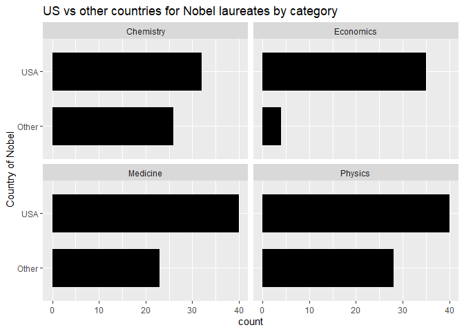

Lab 03 - Nobel laureates
================
Lindley Slipetz
02/09/2021

### Load packages and data

``` r
library(tidyverse) 
```

``` r
nobel <- read_csv("data/nobel.csv")
```

## Exercises

### Exercise 1

``` r
glimpse(nobel)
```

    ## Observations: 935
    ## Variables: 26
    ## $ id                    <dbl> 1, 2, 3, 4, 5, 6, 6, 8, 9, 10, 11, 12, 13, 14...
    ## $ firstname             <chr> "Wilhelm Conrad", "Hendrik A.", "Pieter", "He...
    ## $ surname               <chr> "Röntgen", "Lorentz", "Zeeman", "Becquerel", ...
    ## $ year                  <dbl> 1901, 1902, 1902, 1903, 1903, 1903, 1911, 190...
    ## $ category              <chr> "Physics", "Physics", "Physics", "Physics", "...
    ## $ affiliation           <chr> "Munich University", "Leiden University", "Am...
    ## $ city                  <chr> "Munich", "Leiden", "Amsterdam", "Paris", "Pa...
    ## $ country               <chr> "Germany", "Netherlands", "Netherlands", "Fra...
    ## $ born_date             <date> 1845-03-27, 1853-07-18, 1865-05-25, 1852-12-...
    ## $ died_date             <date> 1923-02-10, 1928-02-04, 1943-10-09, 1908-08-...
    ## $ gender                <chr> "male", "male", "male", "male", "male", "fema...
    ## $ born_city             <chr> "Remscheid", "Arnhem", "Zonnemaire", "Paris",...
    ## $ born_country          <chr> "Germany", "Netherlands", "Netherlands", "Fra...
    ## $ born_country_code     <chr> "DE", "NL", "NL", "FR", "FR", "PL", "PL", "GB...
    ## $ died_city             <chr> "Munich", NA, "Amsterdam", NA, "Paris", "Sall...
    ## $ died_country          <chr> "Germany", "Netherlands", "Netherlands", "Fra...
    ## $ died_country_code     <chr> "DE", "NL", "NL", "FR", "FR", "FR", "FR", "GB...
    ## $ overall_motivation    <chr> NA, NA, NA, NA, NA, NA, NA, NA, NA, NA, NA, N...
    ## $ share                 <dbl> 1, 2, 2, 2, 4, 4, 1, 1, 1, 1, 1, 1, 2, 2, 1, ...
    ## $ motivation            <chr> "\"in recognition of the extraordinary servic...
    ## $ born_country_original <chr> "Prussia (now Germany)", "the Netherlands", "...
    ## $ born_city_original    <chr> "Lennep (now Remscheid)", "Arnhem", "Zonnemai...
    ## $ died_country_original <chr> "Germany", "the Netherlands", "the Netherland...
    ## $ died_city_original    <chr> "Munich", NA, "Amsterdam", NA, "Paris", "Sall...
    ## $ city_original         <chr> "Munich", "Leiden", "Amsterdam", "Paris", "Pa...
    ## $ country_original      <chr> "Germany", "the Netherlands", "the Netherland...

There are 935 rows and 26 columns. The rows represent nobel laureates.

### Exercise 2

``` r
nobel_living <- nobel %>%
  filter(is.na(country) == FALSE,
         gender != "org",
         is.na(died_date))
```

### Exercise 3

``` r
nobel_living <- nobel_living %>%
  mutate(
    country_us = if_else(country == "USA", "USA", 
                         "Other")
                )
```

``` r
nobel_living_science <- nobel_living %>%
  filter(category %in% c("Physics", "Medicine", "Chemistry", "Economics"))
```

``` r
ggplot(nobel_living, aes(x=factor(country_us)))+
  geom_bar(stat="count", width=0.7, fill="black")+
  facet_wrap(~category, nrow = 2) +
  labs(x = "Country of Nobel", 
      title = "US vs other countries for Nobel laureates by category") +
  coord_flip()
```

<!-- --> The claim that most
nobels come from the US is supported. It remains to be seen if, of those
from the US, they come from other countries.

### Exercise 4

…

### Exercise 5

…

### Exercise 6

…
